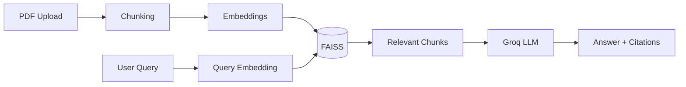

<div align="center">
  


An enterprise-grade Retrieval-Augmented Generation (RAG) system for querying your own PDFs-books, novels, research papers, manuals, reports, or policy documents-in natural language, with every answer grounded in retrieved context and traced back to the exact page it came from.

Runs locally: your documents stay on your machine. Only the user query and the retrieved document excerpts are sent to the LLM for answer generation.

<p align="center">

[](https://www.python.org/)
[](https://flask.palletsprojects.com/)
[](https://streamlit.io/)
[](https://github.com/facebookresearch/faiss)
[](https://groq.com/)
[](#license)

</p>
</div>
---

## Why Archivist

Traditional chatbots answer from what they already "know," making it difficult to verify whether an answer actually comes from your documents.

Archivist generates answers **only** from retrieved content in your uploaded PDFs and provides page-level citations for every response, making verification simple.

Think of it as **NotebookLM for your own infrastructure**-self-hosted, provider-agnostic, and built to be extended.

---

## ✨ Features

- Query any PDF in natural language
- Semantic search using Sentence Transformers
- Page-level citations
- Multi-document support
- Conversational follow-ups
- Flask and Streamlit front ends sharing one FAISS index
- Local embeddings for privacy
- Robust PDF parsing with graceful fallback handling

---

## 🧠 How it works



### Mapping to the RAG Pipeline

| Step | Implementation |
|------|----------------|
| Document Processing | `modules/document_processor.py` extracts text page-by-page and creates overlapping sentence-aware chunks. |
| Embeddings | `modules/vector_store.py` creates Sentence Transformer embeddings and stores them in FAISS. |
| Retrieval | Semantic cosine similarity search over indexed chunks. |
| Generation | `modules/llm_client.py` injects retrieved context into the LLM prompt and produces grounded answers with citations. |

---

## 🖥️ Two Front Ends

### Flask

```bash
python app.py
```

### Streamlit

```bash
streamlit run streamlit_app.py
```

Both interfaces share the same vector database.

---

## 🚀 Quick Start

```bash
git clone https://github.com/<your-username>/archivist.git
cd archivist

python -m venv venv
# Windows
venv\Scripts\activate

pip install -r requirements.txt
```

Download a free Groq API key from https://console.groq.com/keys

```bash
export GROQ_API_KEY="gsk_..."
# Windows
set GROQ_API_KEY=gsk_...
```

Run:

```bash
python app.py
```
or

```bash
streamlit run streamlit_app.py
```

---

## 📁 Project Structure

```text
archivist/
├── app.py
├── streamlit_app.py
├── config.py
├── modules/
│   ├── document_processor.py
│   ├── vector_store.py
│   └── llm_client.py
├── templates/
├── static/
├── data/
└── requirements.txt
```

---

## ⚙️ Design Choices

- Local Sentence Transformer embeddings keep documents private.
- FAISS `IndexFlatIP` provides exact cosine similarity search.
- Every response is freshly grounded in retrieved chunks.
- Shared persistent vector index for both UIs.
- OCR can be added later for scanned PDFs.

---

## 🛠️ Tech Stack

| Layer | Technology |
|------|------------|
| PDF Parsing | PyMuPDF, pypdf |
| Embeddings | sentence-transformers (`all-MiniLM-L6-v2`) |
| Vector Search | FAISS |
| LLM | Groq API |
| Backend | Python(3.11) , Flask |
| Frontend | Flask + Vanilla JS, Streamlit |

---

## 🗺️ Roadmap

- Provider-agnostic LLM support
- Local inference
- Hybrid search
- Cross-encoder reranking
- OCR support
- Pinecone / Qdrant integration
- Authentication
- Multi-user support
- Streaming responses
- Analytics dashboard

---
## 📸 Outputs

### 🏠 1. Home Interface

*Initial landing page showcasing the chat interface, document library, and sidebar.*

<p align="center">
  
</p>

---

### 📄 2. Uploading Documents

*Uploading one or more PDF documents to build the knowledge base.*

<p align="center">
  
</p>

---

### ⚙️ 3. Document Indexing

*Documents successfully processed into sentence-aware chunks, embedded, and stored in the FAISS vector database.*

<p align="center">
  
</p>

---

### 💬 4. Querying Documents & AI-Generated Response

*Users can ask natural language questions about their uploaded documents. Archivist retrieves the most relevant passages from the FAISS vector store and generates a grounded response using the Groq LLM, complete with page-level citations for verification.*

<p align="center">
  
</p>

<p align="center">
  
</p>

---
## 🤝 Contributing

Issues and pull requests are welcome.

---

## 📄 License

MIT License.

---

<p align="center">
<sub>Built as part of a final-year project.</sub>
</p>
